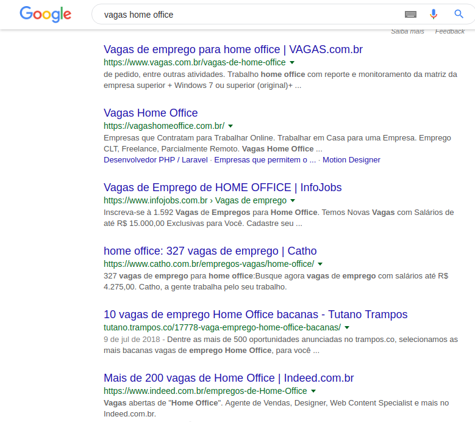
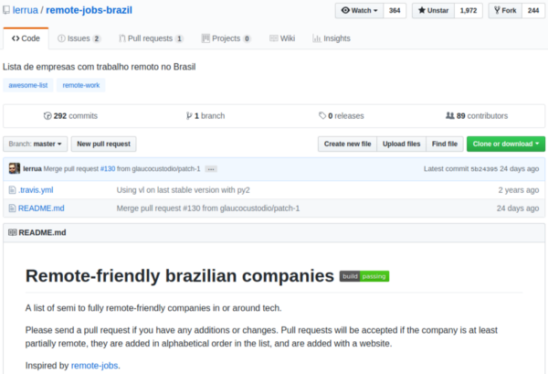

Um relato sobre os aprendizados que tive para se conseguir um trabalho home office e que talvez te ajude a conseguir um.

### A decisão de trabalhar home office

Antes de começar a trabalhar home office, eu trabalhava presencial em uma empresa. Após um longo tempo pensando nos pontos em que eu queria mudar em minha carreira, cheguei a conclusão que gostaria de trabalhar home office (falarei mais sobre isso em outro artigo), então comecei a pesquisar.

O passo inicial que tomei, acredito que seja o que muitos fazem quando querem trocar de emprego, foi realizar uma busca simples no google e ver o que eu encontrava de vagas, porém, a maioria dos resultados levava a sites que divulgavam vagas:

Comecei a olhar a maioria dos sites que a pesquisa me trouxe, para ver quais os requisitos das vagas, de onde eram as empresas, fazer um overview para ter uma noção do que eu iria precisar. Analisando os sites, pude perceber que alguns divulgavam vagas remotas do exterior, nisso veio a primeira questão a ser resolvida:

> Eu irei procurar vagas do exterior ou apenas do Brasil?

Se você deseja arranjar um trabalho home office, eu aconselho fortemente que você responda essa questão primeiro, pois é mais fácil você encontrar um site de vagas do exterior, do que um site de vagas do Brasil com vagas no exterior, então você focando em apenas um, sua busca se torna mais assertiva. Eu decidi que eu iria inicialmente procurar vagas do exterior, porém, se eu não conseguisse em um determinado tempo iria procurar apenas aqui.

Como pude perceber, é mais fácil você encontrar um site específico para vagas de empresas, do que sites de empresas que mostre as vagas.

### Procurando sites com vagas do exterior

Começando a busca pelo os sites que tinham vagas do exterior, como não é difícil de se imaginar, a quantidade de resultados é gigantesca, por isso eu resolvi focar na qualidade dos sites e não em quantidade de sites encontrados. Os sites que escolhi, eram sites que tinham muitas vagas e/ou as vagas eram muito no perfil em que procurava. Os escolhidos foram:

*   [reed.co.uk](https://www.reed.co.uk/)
*   [remotePHP.io](https://remotephp.io/)
*   [stackoverflow.com/jobs](https://stackoverflow.com/jobs)
*   [justremote.co](https://justremote.co/)

Encontrado esses sites, comecei a pesquisar neles as vagas com tecnologias que me interessavam e claro com o filtro de remoto. Cada vaga que me interessava eu aplicava, afinal o que era de se esperar era pelo menos uma entrevista.

> **Dica:** A maioria dos sites de vagas, tem uma funcionalidade de notificar via email quando tem novas vagas baseado em um filtro que você determina.

### Aprendizado com o primeiro não

Importante dizer que durante tudo que eu relatar aqui, algumas coisas aconteceram de forma assíncrona, como este aprendizado.

Eu ainda estava aplicando nas vagas que eu encontrava nos sites escolhidos, porém de uma forma que queria gerar quantidade, até que consegui a primeira entrevista e que foi de certa forma um fracasso graças a minha abordagem.

Conversando com o recrutador da empresa, surgiram perguntas até que comum nas entrevistas, como: *sobre minha experiência*, 
*como eu me comportava em trabalho em equipe*, *quais eram meus defeitos e qualidades*, coisas clichês em entrevistas, até 
que ele me fez uma pergunta simples mas que mudou todo o rumo da entrevista: “*O que você sabe sobre a empresa?*” e nesse momento 
eu travei, pois eu **não sabia nada, além do nome da empresa**, respondendo que não consegui pesquisar e não sabia nada, 
ele respondeu “*Então você não sabe nada sobre nós?*”, então vocês já podem adivinhar que caminho 
essa entrevista tomou.

Depois de um certo tempo recebi a resposta dessa empresa e obviamente a resposta era não, porém com a dica, “_Aconselhamos você pesquisar mais sobre as empresas em que deseja trabalhar_”. Isso pode ter sido muito ingênuo da minha parte, mas a partir disso eu comecei a pesquisar sobre todas as empresas que eu aplicava e pesquisava novamente sobre as quais eu tinha uma entrevista agendada.

### Preparando minhas informações

Não precisei muito para notar que o processo de aplicar em vagas é algo muito repetitivo, pois basicamente você irá preencher a mesmas informações várias vezes, mas na maioria dos casos isso não era um problema, pois qual a dificuldade de copiar e colar o link do seu GitHub? Mas o maior complicado de se preencher era aqueles campos em que pedia algo descritivo sobre você, como um ‘Cover letter’.

Sabendo disso, resolvi pegar o que eu tinha preenchido nas vagas e salvar no Keep, para simplesmente copiar e colar nas próximas vagas. O que anotei:

*   Cover letter
*   Experience summary
*   About me

Isso vai lhe poupar muito tempo, pois no meu caso além de eu não falar e escrever inglês nativamente, eu “perdia muito tempo” escrevendo cada um especifico para cada vaga, então tendo um genérico bem feito foi uma ótima solução.

> **Importante:** Mesmo que você aplique em várias vagas, pode ser que o retorno não seja tão alto, de várias vagas aplicadas, poucas resultaram em entrevistas, então não fique decepcionado se isso acontecer.

### Se rendendo ao clássico LinkedIn

Nunca gostei muito do LinkedIn, mas tinha meu perfil lá e para todos que eu falava sobre essa vontade de arrumar outro emprego, respondiam _“já olhou se tem vaga no linkedin?”_.

Entrando no LinkedIn dei uma atualizada no perfil e encontrei uma funcionalidade que eu desconhecia, o _Interesses de carreira_, que basicamente você preenche o que você procura em relação a trabalho e consegue ativar seu perfil como interessado em novas oportunidades, imediatamente, ativei.

Após isso, comecei a pesquisar vagas que me interessavam, utilizando coisas como: “_php remote_”, “_javasript remote_” e coisas assim.

> Inclusive, o LinkedIn também tem a mesma funcionalidade de te notificar via email quando existem novas vagas baseado no filtro em que você determinou.

Até esse ponto, eu tinha conseguido algumas entrevistas, porém já notei uma pequena dificuldade no meu inglês.

### O open source também ajuda

A muito tempo atrás eu tinha encontrado o repositório [_remote-jobs-brazil_](https://github.com/lerrua/remote-jobs-brazil) que tinha uma grande lista de empresas que trabalhavam remoto e empregava brasileiros. Quando lembrei desse repositório, acessei para ver as empresas que tinham, como meu foco era empresas do exterior fui no segundo tópico _“Worldwide companies that hire brazilians to work remotely_”.

Comecei a acessar os links de todas as empresas da lista, para os links que levavam direto ao site da empresa, eu procurava no menu ou no rodapé coisas como _Jobs_, _Careers_ ou _Work with us_ e se a vaga me interessava, eu aplicava.

Devo dizer que esse foi o método mais eficaz de todos, pois aparentemente a plataforma que a empresa propõe é a que tem o retorno mais rápido. Os emails eram respondido mais rapidamente e consegui mais entrevistas dessa maneira do que em site de terceiros.

### O meu inglês não estava pronto

Até esse momento eu tinha conseguindo várias entrevistas, porém, como já era de se esperar eu pude perceber que meu inglês não estava tão bom. Em várias conversas com pessoas das empresas, eu tinha algumas dificuldades em falar sobre certas coisas, porém o mais incrível foi que as empresas obviamente notaram isso mas foram super educadas e continuaram com a possibilidade, inclusive algumas falaram que durante a continuação do processo seletivo era bom que eu entrasse em um curso de inglês intensivo para fazer isso funcionar.

Porém, depois de muitas entrevistas e de muitas repostas negativas, pude perceber uma coisa, meu inglês não estava tão bom e foi ai que percebi que talvez uma vaga do exterior não fizesse tanto sentido agora. Então, vamos recomeçar só que procurando vagas do Brasil.

### Procurando sites com vagas do Brasil

Comecei exatamente da mesma maneira que havia começado antes, seguindo os mesmos passos, primeiro procurando sites com vagas, pesquisar no LinkedIn vagas, olhar o repositório com de vagas remotas com empresas brasileiras que trabalhavam remotamente. Porém como os métodos já feitos me traziam uma grande variedade de vagas, eu escolhi apenas um site com vagas, o [_Programathor_](https://programathor.com.br).

Um bloqueio que eu tinha quando procurava vagas no exterior, era sobre me comunicar bem de forma confiante, então muitas vezes deixei de entrar em contato com alguns sites “não escolhidos” por causa disso, mas agora tudo se tornara mais fácil. Eu já tinha ouvido falar sobre empresas recrutadoras, que fazem um match do seu perfil com perfil de profissional que as empresas procuravam, então também comecei a pesquisar recrutadoras e perguntei indicações para alguns conhecidos. Acabei selecionado, acredito que seja as mais conhecidas:

*   [geekhunter.com.br](https://www.geekhunter.com.br/)
*   [revelo.com.br](https://www.revelo.com.br/)

O processo com as duas recrutadoras, foi incrível, inclusive fiquei surpreendido com a ligação da Geek Hunter, perguntando qual era o perfil de vagas que eu procurava, conversamos sobre isso e comentei que eu gostaria apenas de vagas home office e se existia hoje vagas assim ali, ela respondeu que não tinham muitas vagas home office, a maioria era presencial, mas que era possível. Infelizmente com as duas recrutadora a maioria das empresas que entraram em contato comigo foi para vagas presenciais, mesmo assim aconselho fortemente vocês entenderem como funciona o processo, pois pode ser bem útil caso estejam procurando vagas.

### Finalmente conseguindo um trabalho home office

Como já dito, muito das abordagens descritas aqui, foram feitas ao mesmo tempo, então pode ser que enquanto eu procurava vagas nas empresas do repositório eu estava ainda procurando vagas nos sites de vagas. Isso é importante dizer porque mesmo o ultimo passo descrito sendo o das recrutadoras, não foi assim que eu consegui o trabalho.

Outro ponto importante, mesmo que pareça que foi várias decisões uma atrás da outra para procurar as vagas, elas demoraram para acontecer, ou seja, eu fiquei um tempo vendo as vagas dos sites com lista de vagas, pesquisava sempre no LinkedIn para ver se tinha aparecido algo novo, então não adianta fazer tudo de uma vez, o processo precisa acontecer sempre.

Enquanto eu procurava vagas nas empresas no repositório [_remotes-jobs-brazil_](https://github.com/lerrua/remote-jobs-brazil) eu encontrei uma vaga na empresa [Crawly](https://www.crawly.com.br/), que é a empresa que estou hoje. O processo foi algo bem amigável, onde em algumas etapas conversei com o CTO e com o CEO.

### Os maiores aprendizados dessa busca

Desse processo todo, consegui aprender algumas coisas bem importantes que com certeza podem te ajudar, alguma dessas coisas podem ser bem contraditórias a maneira em que procurei, então você que irá decidir qual a dose certa para cada decisão.

*   Apenas aplique para as vagas em que você se sentir no mínimo um pouco confortável, mesmo que o incômodo pareça ser tentador para aprendizado pessoal, talvez você deva ir devagar com o quão desconfortável é, pois você pode acabar não levando a lugar nenhum, assim como foi com vagas do exterior no meu caso.
*   Conheça as empresas em que você irá fazer entrevista, afinal de contas o seu objetivo é trabalhar lá.
*   Muitas entrevistas podem ser um problema (eu sei que é meio contraditório ao ponto de se aplicar em várias vagas), a maioria dos processos seletivos tem uma etapa em que você irá ter que fazer algo prático com um prazo muito curto, então imagine você com 4 testes práticos para entregar em 7 dias e tendo que consolidar com seu trabalho atual, vida pessoa, etc.

Espero que isso te ajude de alguma forma.