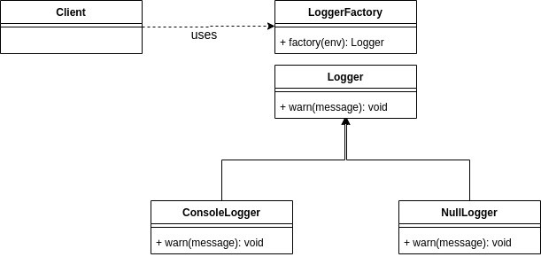

É muito comum criarmos métodos que possam retornar valores nulos em determinadas
situações onde a informação requisitada não está presente ou algumas condições
não são atendidas para executar determinada lógica de negocio. Ao utilizar essa
abordagem, pode ser necessário criar verificações do código para garantir que
eles não sejam nulos antes de chamar algum método ou obter algum estado, pois
normalmente não é possível chamar métodos em referências nulas. Muitas pessoas
chamam isso de “programação defensiva” e como consequência acabam criando
verificações quando intuitivamente não fazem sentido, mas isso demonstra que na
verdade o que acontece é que o controle do código foi perdido.

Os problemas de se essa abordagem não é algo novo em nossa área, tanto que [Tony
Hoare](https://en.wikipedia.org/wiki/Tony_Hoare) em sua apresentação na QCon
Lodon 2009 chamou isso de “[erro de bilhões de
dólares](https://www.infoq.com/presentations/Null-References-The-Billion-Dollar-Mistake-Tony-Hoare/)”
e pediu desculpas por inventar a referência nula.

> I call it my billion-dollar mistake. It was the invention of the null reference
> in 1965. At that time, I was designing the first comprehensive type system for
references in an object oriented language ([ALGOL
W](https://en.wikipedia.org/wiki/ALGOL_W)). My goal was to ensure that all use
of references should be absolutely safe, with checking performed automatically
by the compiler. But I couldn’t resist the temptation to put in a null
reference, simply because it was so easy to implement. This has led to
innumerable errors, vulnerabilities, and system crashes, which have probably
caused a billion dollars of pain and damage in the last forty years. <br> — Tony
Hoare

Quando falamos especificamente sobre orientação a objetos, trabalhar com
referência nula pode ser um problema um pouco mais complexo quando analisamos o
design do nosso código. Steve Smith (entre alguns outros programadores) defende
no artigo *[Nulls Break
Polymorphism](https://ardalis.com/nulls-break-polymorphism)* em seu blog que ao
utilizar referência nula nós quebramos o polimorfismo e violamos o [princípio da
substituição de Liskov ](https://deviq.com/liskov-substitution-principle/)do
SOLID.

Mas não pense que esse problema de referência nula é uma particularidade apenas
de linguagens orientada a objetos. No artigo *[Top 10 JavaScript errors from
1000+ projects (and how to avoid
them)](https://rollbar.com/blog/top-10-javascript-errors/)* que está no blog da
empresa [Rollbar](https://rollbar.com/), podemos ver que 8 dos 10 erros são
problemas de nulos e indefinidos.

São várias as possibilidades que tentam ajudar resolver esse tipo de problema,
uma delas é o design pattern *Null Object*.

### A ideia básica

O *Null Object* é um design pattern que utiliza herança para criar
representações válidas de um dado de valor *null*. A intenção desse padrão é
fornecer uma alternativa ao objeto original, oferecendo uma assinatura igual sem
estado e comportamento.

Utilizando esse padrão ao invés de a todo momento termos que escrever
verificações do código antes de realizar uma operação, podemos criar uma
representação não funcional do objeto esperado. Essa representação tem a mesma
assinatura do objeto esperado, em linguagens orientada a objetos isso é possível
implementando a mesma interface ou estendendo a mesma classe (muitas vezes
abstrata) e já em linguagens que seguem outro paradigma, basta ele ter a mesma
assinatura.

Esta forma ajuda a evitar alguns efeitos colaterais e facilita um pouco a
codificação pois não precisa tratar casos que são exceção à regra. Além disso
essa forma tende a seguir um pouco mais a orientação a objetos, pois fornece
abstrações em cenários desconhecidos.

Agora vamos imaginar uma situação onde o nosso cliente precisa fazer *log* de
algumas informações, porém cada ambiente deverá ter um alvo de *log* diferente,
sendo que o ambiente de produção não terá *log* nenhum e o ambiente de
desenvolvimento utilizará o *log* por console. Quem será responsável por decidir
qual *log* será utilizado é uma
[factory](https://sourcemaking.com/design_patterns/factory_method). Seguindo a
abordagem inicial, quando o ambiente for de produção onde não deverá existir
*log*, basta retornar *null*. Teríamos algo mais ou menos assim:

```typescript
interface Logger {
  warn(message: string): void;
}

class ConsoleLogger implements Logger {
  warn(message: string): void {
    console.warn(message);
  }
}

class LoggerFactory {
  factory(env: string): Logger | null {
    if (env === 'development') {
      return new ConsoleLogger();
    }

    return null;
  }
}

class Client {
  execute() {
    const logger = (new LoggerFactory()).factory('production');

    if (logger !== null) {
      logger.warn('It\'s on fire, bicho');
    }
  }
}
```

No exemplo, temos a interface *Logger* que representará todos os tipos de logs,
temos também a *factory* *LoggerFactory* responsável por decidir qual mecanismo
de *log* criar baseado no ambiente e que pode retornar *null* e por último a
classe *Client* que utiliza a factory e faz uma verificação para ver se é
*null*.

Com esse exemplo extremamente simples podemos notar algumas coisas:

* Todo lugar que for utilizar a *factory* terá que criar uma verificação se o
resultado é de valor nulo;
* Não é de responsabilidade do cliente saber se é nulo ou não, ele apenas quer
logar suas informações;
* Ao escrever alguns testes para a classe *Client* teremos alguns casos a mais
para tratar essa exceção.

Podemos ver que para a nossa necessidade a possibilidade de se obter nulo é um
efeito colateral desnecessário e problemático. Para solucionar isso podemos ter
a seguinte solução:



Analisando o nosso exemplo, deduzimos e comparamos com o exemplo anterior o
seguinte:

* O Client utiliza o *LoggerFactory* para criar a instancia do mecanismo de *log*,
assim como no exemplo anterior;
* A *factory LoggerFactory* é capaz de criar **apenas instâncias de Logger**,
diferente do exemplo anterior que poderia criar *Logger* e *null*;
* A interface *Logger* define o contrato que o cliente utilizará, assim como no
exemplo anterior;
* A classe *ConsoleLogger* implementa a interface *Logger* e provém um
comportamento funcional, assim como no exemplo anterior;
* A classe *NullLogger* implementa a classe *Logger* e provém um comportamento
neutro, diferente do exemplo anterior onde não existia essa classe.

Analisando o diagrama, podemos ver que pouca coisa realmente mudou, mas ao
escrevermos logo de cara é visível as mudanças.

```typescript
class NullLogger implements Logger {
  warn(message: string): void {
  }
}

class LoggerFactory {
  factory(env: string): Logger {
    if (env === 'development') {
      return new ConsoleLogger();
    }

    return new NullLogger();
  }
}

class Client {
  execute() {
    const logger = (new LoggerFactory()).factory('production');

    logger.warn('It\'s on fire, bicho');
  }
}
```

Vendo o resultado, conseguimos compreender que agora para o *Client* pouco
importa se realmente a informação será logada ou não, ele apenas confia que a
*factory* retornou o que é necessário para aquela ação naquele contexto e agora
quem for utilizar a *factory* apenas terá a mesma confiança, além disso vemos
também que diminuímos os casos de testes pois não tem mais uma exceção lógica.
Resumidamente, resolvemos os 3 problemas descritos anteriormente.

### Quando usar

Assim como qualquer abordagem que utilizamos em nossa área, cada uma tem seus
casos de uso para determinar quando usar, afinal cada uma tenta resolver
problemas específico. Saber quando usar algo é um ponto fundamental na carreira
da pessoa programadora, pois é isso que determina o caminho para se solucionar o
problema proposto.

Deveríamos usar o padrão *Null Object*, apenas quando o cliente verificaria nulo
apenas para pular a exceção ou executar uma ação padrão, diz[ Krzysztof
Woyke](https://www.baeldung.com/author/krzysztof-woyke/) em seu artigo
[Introduction to the Null Object
Pattern](https://www.baeldung.com/java-null-object-pattern).

Como todos os padrões, o padrão *Null Object* também tem suas vantagens e
desvantagens, pois assim conseguimos definir se as vantagens valem o preço das
desvantagens no nosso caso de uso, ajudando a definir quando usar o padrão.

#### Vantagens

* O cliente consegue lidar de forma mais simples e de maneira uniforme com os
respectivos objetos;
* Reduz a chance de exceções de ponteiro nulo (*NullPointerException);*
* Com menos condicionais, menos casos de teste;
* Esse padrão segue os princípios gerais do
[Tell-Don’t-Ask](https://martinfowler.com/bliki/TellDontAsk.html).
* Evita quebrar o polimorfismo e violar o LSP do SOLID causado pelos valores
nulos.

#### Desvantagens

* Pode esconder problemas que seriam pegos ao utilizar valores *null*;
* Se não bem explicito para os responsáveis pela manutenção, pode ser que acabem
criando desnecessariamente os *null check’s* mesmo com essa abordagem;
* Pode ser necessário criar vários *NullObject’s* aninhados devido a abstração que
o *NullObject* representa.

Um ponto importante que também deve ser levado em consideração na hora de
decidir se vale a pena usar o design pattern *Null Object* é saber que na
maioria das vezes ele será utilizado com outro padrão, seja uma *factory*, 
*builder* ou outro. Isso determina saber quando usar o outro padrão também e
saber se a utilização de ambos faz sentido para o caso de uso apresentado.

Antes de sair colocando esse padrão em todos os seus projetos e alimentando seu
ego, analise com carinho se isso que você está fazendo é algo realmente benéfico
ou é algo que vai te tirar algumas noites de sono.

Espero que isso te ajude de alguma forma.
