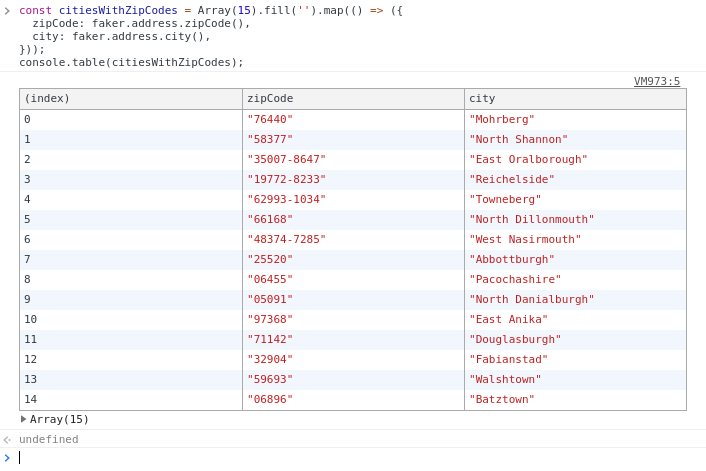
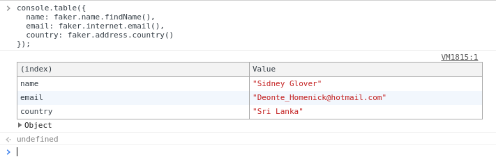
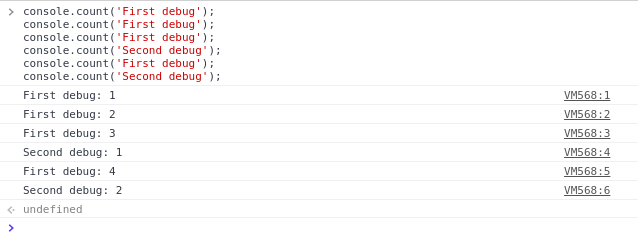
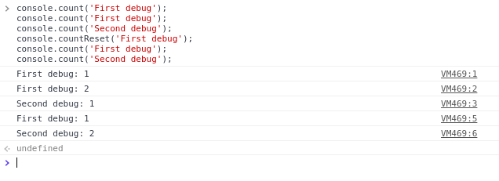
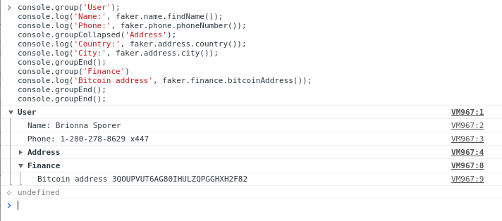
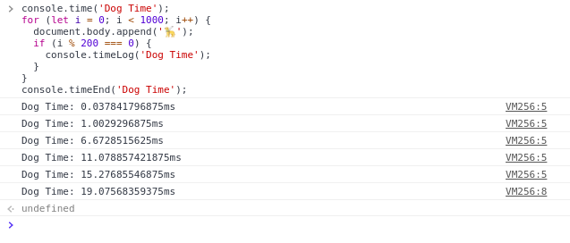

Toda pessoa que já passou pela necessidade de _debugar_ algum código em JavaScript com certeza em algum momento teve que usar o famoso `console.log()`. Muitos de nós ainda utiliza esse método até os dias de hoje, mesmo que alguns não gostem de admitir.

Uma [pesquisa](https://blog.risingstack.com/node-js-developer-survey-results-2016/) feita pelo site [Rising Stack](https://risingstack.com/) em 2016 que tinha o objetivo entender como os desenvolvedores utilizam node, concluiu que cerca de ¾ das pessoas utilizam o método `console.log()` para encontrar erros. Mesmo que exista ferramentas que são muito melhores para _debugar_, é inevitável o reconhecimento da facilidade e da quantidade de pessoas que ainda utilizam.

Sabemos que é muito fácil utilizar o `console.log()` em nossos códigos, porém em alguns casos é necessário realizar algumas adaptações no _debug_ para que seja possível fazer a analise corretamente, isso devido a nossa necessidade ser diferente do propósito do método. O que muitos talvez não saibam é que a própria [_API_ do _console_](https://console.spec.whatwg.org/) oferece uma variedade de outros métodos que podem ajudar de forma mais eficiente a resolver os problemas que estamos enfrentando.

## Log simples

Sabemos que o que o método `console.log()` mais resolve são _logs_ simples, mas até mesmo os _logs_ simples podem ter algumas pequenas particularidades. Imagine uma situação onde você precise mostrar mensagens de alerta e erro. Claramente as mensagens de alerta são mais criteriosas que mensagens comuns e mensagens de erros mais criteriosas que a de alerta. Devido a criticidade desses tipos de mensagens, precisamos de um destaque maior para elas. Para ajudar nessa situação temos 2 métodos: `console.warn()` e `console.error()` .

Podemos ver no exemplo que o método `warn()` produz uma mensagem com o estilo de alerta e já o `error()` uma mensagem com estilo de erro. O exemplo também nos apresenta um método novo `console.info()`, esse método no _Chrome_ tem exatamente o mesmo resultado que o nosso já conhecido `console.log()`.

Mas você não precisa necessariamente ficar preso apenas no estilo já proposto pela plataforma utilizada. Os métodos de _log_ simples seguem o [formato de estilo _printf_](https://en.wikipedia.org/wiki/Printf_format_string), caso a primeira string siga esse formato. Dessa maneira é possível fazer algumas mudanças em como nossa mensagem é apresentada, seja em sua cor ou como chamamos o método.

Caso o primeiro argumento contenha `%c` o segundo argumento aceita propriedades CSS. Com essa possibilidade até mesmo o nosso queridíssimo `console.log()` pode se tornar mais elegante, se necessário.

## Listar valores de listas ou objetos

É impossível programar em JavaScript e não utilizar listas ou objetos. _Debugar_ essas estruturas de dados pode ser um pouco desagradável, dependendo do que é necessário. Em estruturas grandes, você encontrar valores utilizando o `console.log()` pode ser um pouco trabalhoso, isso quando não precisa ordená-los para facilitar a visualização. Na maioria dos casos, será necessário uma adaptação no código para facilitar o _debug_.

Para tornar a visualização desses dados mais fácil a _API_ do _console_ nos oferece um método chamado `console.table()` que tem como objetivo montar uma tabela com os dados apresentados. O primeiro parâmetro é a estrutura de dados que você quer apresentar. Essa estrutura não precisa ser necessariamente um _array_.

No exemplo foi utilizado a biblioteca [Faker.js](https://github.com/marak/Faker.js/) para criar uma estrutura com dados falsos. Podemos ver que essa estrutura fica visivelmente muito mais simples. Neste caso, a estrutura é um _array_ de objetos, mas qualquer tipo de estrutura de dados é permitido.

O método sempre tentará encontrar um _index_ que represente cada item da estrutura. No caso de um _array_ é o _index_ do item dentro da lista, já em objetos é o nome da propriedade, formando assim uma tabela de chave valor.

## Contagem

Fazer a contagem de algum trecho do código pode ser extremamente necessário, seja de uma iteração, resultado de evento ou invocação de método. É bem provável que você opte por incrementar uma variável e ficar fazendo _log_ dela a cada momento necessário, porém pode ser necessário fazer alguma adaptação no código para que isso seja possível no momento em que você está desenvolvendo. Mas por que não utilizar algo nativo que facilite esse _debug_?

O método `console.count()` nos auxilia a realizar essas contagens de forma muito mais simples. O primeiro argumento do método (que é opcional) é uma descrição que identifica o que está sendo contado, caso o método seja chamado com a mesma descrição, sua contagem é incrementada e apresentada na tela.

Também pode ser necessário reiniciar essa contagem em algum momento do nosso _debug_ e para esse problema também temos uma solução. O método `console.countReset()` realiza essa reinicialização na contagem. Para identificar a contagem a ser reinicializada basta informar a descrição no primeiro parâmetro, da mesma maneira que o `console.count()` funciona.

## Agrupamento de log’s

Em métodos muito grandes pode ser um pouco complexo _debugar_ utilizando o _console_ caso seja necessário demonstrar várias informações diferentes. Muitas vezes optamos por colocar prefixos que nos ajudem a identificar o grupo em que a informação pertence. De qualquer maneira o nosso objetivo é tornar õ processo de _debug_ mais simples e apresentar a informação de uma forma mais agradável.

Para nos ajudar, a _API_ do _console_ oferece o método `console.group()` que tem como objetivo agrupar os _logs_. Esse método deve ser usado em conjunto com o nosso já conhecido `console.log()`. Para se utilizar, primeiro chamamos o método `console.group()` que recebe como parâmetro a descrição do grupo, que seria como uma identificação e todos os _logs_ que vierem após isso, entrarão nesse grupo. O mais interessante é que você pode ter mais grupos dentro de grupos, bastando apenas defini-los sequencialmente. Após fazer o _log_ de todas informações necessárias daquele grupo, é preciso chamar o método `console.groupEnd()` para informar que o último grupo foi finalizado, dessa maneira todos os _logs_ posteriores não vão mais pertencer à aquele grupo.

No exemplo, foi utilizado novamente a biblioteca [_Faker.js_](https://github.com/marak/Faker.js/) para poder ilustrar melhor as informações. É possível ver no resultado o agrupamento das informações além de ser possível esconder ou mostrar o conteúdo do grupo. Caso você queira que o _log_ de um grupo comece com seu conteúdo escondido, basta utilizar o método `console.groupCollapsed()`.

## Tempo de execução

Quando estamos com problemas de performance em nossa aplicação a primeira coisa que fazemos é tentar descobrir qual trecho está causando problemas. Para isso, precisamos descobrir quanto tempo nossos trechos de código estão levando para serem executados. Obviamente esse não é o único caso em que é necessário descobrir o tempo de execução de um trecho, mas com certeza é um dos mais frequentes. Como todas as outras necessidades já apresentadas, essa também tem muitas maneiras de solucionar. Você pode comparar datas ou até mesmo analisar visualmente os log’s simples e ver quanto tempo cada um demora para aparecer. Para tentar facilitar a nossa vida e evitar adaptações malucas em nossos códigos a _API_ do _console_ também oferece alguns métodos que podem nos ajudar.

Os métodos necessários para se medir o tempo de execução de um trecho de código são `console.time()` e `console.timeEnd()`. Ambos os métodos recebem como primeiro parâmetro a descrição do que está sendo medido, essa descrição serve como um identificador, dessa maneira é possível fazer várias medições em vários trechos de código junto. O método `console.time()` deve ser chamado no início do trecho a ser analisado e o `console.timeEnd()` no final. O tempo de execução será apresentado apenas após o método `console.timeEnd()` for invocado.

Mas dependendo da situação pode ser necessário saber durante o trecho do código quanto tempo já se passou e isso também é possível com a fantástica _API_ do _console_. O método `console.timeLog()` faz um log simples durante a execução do código, diferente do `console.timeEnd()` que faz apenas no final. Igual aos outros métodos, esse método espera no primeiro parâmetro a descrição do que está sendo medido.

## Nem só de console vive o homem

Mesmo não tendo apresentado todos os métodos presentes na _API_ do _console_, é possível concluir que ainda sim é uma _API_ fantástica e nos oferece muitos métodos que podem facilitar nossas vidas em determinadas situações, porém isso não quer dizer que ela irá resolver todos os seus problemas sempre ou que substitui uma boa ferramenta de _debug_. Cada caso é um caso, mas é inevitável a necessidade de se conhecer novas ferramentas, pois só assim você irá descobrir qual facilita mais a sua vida e te ajuda a resolver os problemas mais facilmente.

Espero que isso te ajude de alguma forma.

