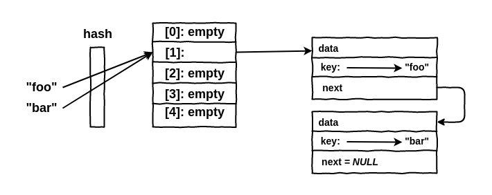

### PHP Internals — Introdução a HashTable

Recentemente iniciei uma jornada de estudos sobre **PHP Internals**,
principalmente sobre as mudanças que ocorreram do PHP 5 para a versão 7.
Infelizmente existe pouco conteúdo sobre o assunto hoje de forma fácil e em
português, por isso me senti motivado a começar a escrever sobre o assunto, para
difundir o conhecimento sobre tal e quem sabe termos como consequência mais
assuntos sobre o mesmo.

### O que é HashTable?

Basicamente podemos dizer que HashTable é uma estrutura de dados onipresente que
associa chaves de pesquisa a valores. Para ficar mais simples, podemos dizer que
no PHP **arrays** **são iguais a HashTables**.

Para quem já teve algum contato com a linguagem C, sabe que não conseguimos
criar valores dentro de **arrays**, que as chaves são qualquer tipo de dados
diferente de **int’s**, já no PHP isso funciona de maneira diferente, pois
nossas chaves podem ser **strings, int’s, floats, nulls e boolean’s**, então
como isso funciona por baixo dos panos? Já que o PHP é em C e em C as coisas são
diferentes? É nesse momento que o HashTable entra.

A idéia do HashTable é bem simples, quando definimos uma chave que é um valor
complexo, como por exemplo uma string, essa chave passa por uma função **hash**,
que retorna um inteiro. Este inteiro, então, é utilizado como índice para um
array “normal”, já que em C não conseguimos colocar strings como chave de
arrays. A estrutura seria algo parecido com isso:

Neste exemplo, queremos alocar um valor em nosso array com a chave **foo**, essa
chave passa pela função **hash** que retorna o inteiro **1**, que será o índice
utilizado para alocar o valor de **foo**.

Com uma estrutura assim, temos alguns problemas, um deles é que duas **strings**
podem retornar o mesmo inteiro, pois as strings são virtualmente infinitas,
enquanto o hash é limitado pelo tamanho dos inteiros. Então as HashTables
precisam implementar alguma maneira de resolver as colisões.

Parar resolver esse problema de colisões, o PHP armazena os elementos que tem o
mesmo índice em uma lista encadeada. Então quando procuramos uma chave, o PHP
calcula o **hash** e em seguida percorre a lista encadeada de “possíveis”
valores até encontrar o valor correspondente, ou não. Os elementos da lista
encadeada são chamados de **Buckets**.

### Buckets

A estrutura de Buckets do HashTable é semelhante a isso:

Neste exemplo, ao inserirmos um valor com a chave **bar** a função **hash** 
retornou o mesmo inteiro da chave **foo** então os elementos foram adicionados
na lista encadeada, sendo que o bucket **foo** tem um ponteiro que aponta para o
próximo bucket que é **bar**.

A lista em que os Buckets são armazenados, é apenas uma lista para todas as
colisões, isso é uma vantagem pois não precisamos de uma alocação de memória
para cada colisão e sim uma alocação gigantesca para a lista inteira. Além
disso, os Buckets são armazenados em ordem de inserção, indiferente da chave que
foi especificada.

Quando armazenamos um valor dentro de nosso array, além de armazenarmos os
Buckets, precisamos armazenar também outras informações, como, **número total de
elementos** que chamaremos de **nNumUsed** e **número de elementos usados** que
chamaremos de **nNumOfElements**, entre outras coisas.

No momento de inserção de elementos não faz muito sentido ter **nNumUsed (número
total de elementos)** e **nNumOfElements (número de elementos usados)**, mas a
partir do momento que começamos a excluir elementos de nosso array, essas
informações se tornam importantes. Imagine o seguinte, se armazenamos 5 itens
dentro de um array, os slots de **0** a **4** estão sendo utilizados, então
temos **nNumUsed** com o valor 5 e **nNumOfElements** também com o valor 5, mas
se deletarmos o elemento que está no slot **2**, que é o nosso terceiro item, o
valor de **nNumUsed** ainda é 5, porém **nNumOfElements** agora é 4.

### Tombstone

Quando deletamos um elemento da lista de Buckets, primeira coisa que fazemos,
como já vimos, é decrementar o valor **nNumOfelements** no Hashtable, depois
disso marcamos o Bucket como excluído, essa marcação é chamada de **Tombstone**.
Mas porque não excluímos o Bucket da lista de Buckets?

Imagine que em uma aplicação temos um array com 1000 elementos, e excluímos o
segundo elemento, se deletássemos esse elemento do Bucket, teríamos que realocar
todos os outros 998 elementos em uma posição anterior, isso não seria nem um
pouco performático, ao invés disso apenas marcamos como excluído e na hora de
percorrer a lista apenas filtramos todos que não são “excluídos”.

### Conclusão

Isso foi apenas uma introdução de como funciona o conceito de HashTable no PHP,
caso tenha interesse em aprender mais coisas, sugiro estes artigos e palestras:

* Palestra: [PHP 7 — What changed internally? — Nikita Popov — Forum PHP
2015](https://youtu.be/zekEqhaPmag?t=767);
* Artigo:[ PHP’s new hashtable
implementation](https://nikic.github.io/2014/12/22/PHPs-new-hashtable-implementation.html)
— Nikita Popov;
* Artigo: [PHP 7 Arrays: HashTables —
](http://blog.jpauli.tech/2016/04/08/hashtables.html)[Julien Pauli tech
life](http://blog.jpauli.tech/);
* Artigo: [PHP HashTable — Internals
Book.](http://www.phpinternalsbook.com/hashtables.html)
