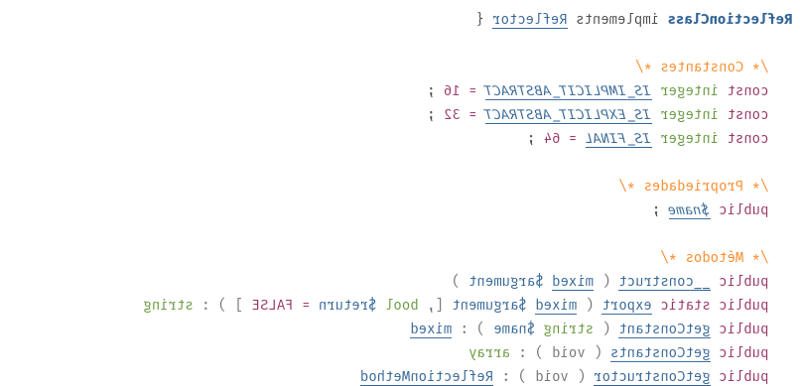

São inúmeras linguagens de programação que disponibiliza mecanismos para se
fazer reflexão em estruturas de dados, no PHP isso também não seria diferente.
Mas antes precisamos entender, o que é **reflexão**?

> Em ciência da computação, **reflexão computacional** (ou somente **reflexão**) é
> a capacidade de um programa observar ou até mesmo modificar sua estrutura ou
comportamento. — Wikipedia.

Se você tem uma pequena vivência com o PHP, provavelmente já deve ter encontrado
algum código “mágico” que resolve algum problema. Um exemplo um pouco comum é a
injeção de dependência do Laravel (que não é exclusividade da ferramenta), vamos
ver um exemplo (caso você não tenha vivência com o Laravel, não tem problema):

```php
<?php

namespace App\Http\Controllers;

use App\Repositories\UserRepository;

class UserController extends Controller
{
    /**
     * The user repository instance.
     */
    protected $users;

    /**
     * Create a new controller instance.
     *
     * @param  UserRepository  $users
     * @return void
     */
    public function __construct(UserRepository $users)
    {
        $this->users = $users;
    }
}
```

Se analisarmos o exemplo, vemos que o construtor da nossa classe
`UserController` espera uma instância de `UserRepository`, certo? Até aqui, sem
problemas, apenas PHP. A “mágica” do Laravel acontece quando o próprio framework
cria a instância de `UserRepository` e passa automaticamente para o nosso
controller. Para isso, o framework utiliza um padrão chamado *service container*
que por outro lado utiliza uma técnica chamada injeção de dependência.
Basicamente, o *service container* analisa que a classe `UserController` precisa
de um `UserRepository` para ser instanciado e cria essa instância, mas como ele
sabe que ele precisa dessa instância? Com **reflexão**.

Trabalhar com **reflexão** no PHP é possível graças as classes mágicas de
[Reflection](https://www.php.net/manual/pt_BR/book.reflection.php) do PHP. Essas
classes estão disponíveis no *core *da linguagem desde a versão 5, então não é
necessário fazer nenhuma instalação. Existem algumas classes de **Reflection**
no PHP, sendo que cada uma depende de onde você vai aplicar:

* [ReflectionClass](https://www.php.net/manual/pt_BR/class.reflectionclass.php)*
*—* *Utilizar em classes;
* [ReflectionExtension](https://www.php.net/manual/pt_BR/class.reflectionextension.php)*
— Utilizar em extensões;*
* [ReflectionFunction](https://www.php.net/manual/pt_BR/class.reflectionfunction.php)*
*— Utilizar em funções;
* [ReflectionFunctionAbstract](https://www.php.net/manual/pt_BR/class.reflectionfunctionabstract.php)*
*— Utilizar em funções abstratas;
* [ReflectionMethod](https://www.php.net/manual/pt_BR/class.reflectionmethod.php)
— Utilizar em métodos;
* [ReflectionObject](https://www.php.net/manual/pt_BR/class.reflectionobject.php)*
*— Utilizar em
[objetos](https://www.php.net/manual/pt_BR/language.types.object.php);
* [ReflectionParameter](https://www.php.net/manual/pt_BR/class.reflectionparameter.php)
— Utilizar em parâmetros (de métodos ou funções);
* [ReflectionProperty](https://www.php.net/manual/pt_BR/class.reflectionproperty.php)
— Utilizar em propriedades de classes;
* [ReflectionType](https://www.php.net/manual/pt_BR/class.reflectiontype.php)* —
*Utilizar para saber sobre tipos de retorno*;*
* [ReflectionGenerator](https://www.php.net/manual/pt_BR/class.reflectiongenerator.php)*
*— Utilizar em
[geradores](https://www.php.net/manual/pt_BR/class.generator.php).

Vamos seguir com a ideia do exemplo em Laravel, mas agora fora do framework.
Imagine que precisamos instanciar a classe `UserController` que espera uma
instância de `UserRepository`, tudo isso fora do framework.

```php
<?php

class UserRepository
{ }

class UserController {
    private $userRepository;

    public function __construct(UserRepository $repository)
    {
        $this->userRepository = $repository;
    }
}
```

Analisando o nosso pequeno exemplo podemos ver que precisamos descobrir o que o
construtor necessita para que possamos instanciar, tudo isso de forma “mágica”,
utilizando **reflexão**. Se olharmos a lista das classes disponíveis, podemos
notar que existem 2 tipos de classes que chamam a nossa atenção para esse caso,
são as *ReflectionParameter *e *ReflectionMethod*, porem olhando a assinatura é
possível notar que *ReflectionParameter* não serve diretamente para o nosso
caso, pois o primeiro argumento é um
[callable](https://www.php.net/manual/pt_BR/language.types.callable.php) e não é
o caso do nosso `__construct`, então sobra o *ReflectionMethod*. Então, basta
instanciar a classe *ReflectionMethod* passando o nosso controller junto com o
nome do nosso método que é `__construct`.

```php
<?php

class UserRepository
{ }

class UserController {
    private $userRepository;

    public function __construct(UserRepository $repository)
    {
        $this->userRepository = $repository;
    }
}

$constructorReflected = new ReflectionMethod(UserController::class, '__construct');
$constructorParameters = $constructorReflected->getParameters();

$argumentsToConstruct = [];

foreach ($constructorParameters as $parameter) {
    $name = $parameter->getClass()->name;
    var_dump($name);
    // string(14) "UserRepository"

    $instance = new $name();
    var_dump($instance);
    // object(UserRepository)#3 (0) {
    //}

    $argumentsToConstruct[] = $instance;
}

$userController = new UserController(...$argumentsToConstruct);
var_dump ($userController);
// object(UserController)#4 (1) {
//  ["userRepository":"UserController":private]=>
//  object(UserRepository)#3 (0) {
//  }
//}
```

Criamos a nossa reflexão do método `__construct` utilizando a classe
*ReflectionMethod*. O interessante de se analisar é que o método
`getParameters()` da classe de reflexão retorna uma lista de
*ReflectionParameter* que representa cada parâmetro, ou seja, mesmo que não
utilizando o *ReflectionParameter* diretamente acabamos chegando na ideia do
mesmo resultado, tudo isso graças à uma ótima API das classes. Isso não é
particularidade apenas da *ReflectionMethod*, podemos fazer o mesmo utilizando a
classe *ReflectionClass*, criando uma reflexão para o nosso controller e
analisando o construtor do alvo.

```php
<?php

class UserRepository
{ }

class UserController {
    private $userRepository;

    public function __construct(UserRepository $repository)
    {
        $this->userRepository = $repository;
    }
}

$userReflected = new ReflectionClass(UserController::class);
var_dump($userReflected);
// object(ReflectionClass)#1 (1) {
//  ["name"]=>
//  string(14) "UserController"
//}

$constructorParameters = $userReflected->getConstructor()->getParameters();

$argumentsToConstruct = [];

foreach ($constructorParameters as $parameter) {
    $name = $parameter->getClass()->name;
    var_dump($name);
    // string(14) "UserRepository"

    $instance = new $name();
    var_dump($instance);
    // object(UserRepository)#2 (0) {
    //}

    $argumentsToConstruct[] = $instance;
}

$userController = new UserController(...$argumentsToConstruct);
var_dump($userController);
// object(UserController)#4 (1) {
//  ["userRepository":"UserController":private]=>
//  object(UserRepository)#2 (0) {
//  }
//}
```

Dessa maneira, conseguimos começar do nível de cima e ir acessando às nossas
necessidades até o último nível. Com esses pequenos exemplos, conseguimos
começar a entender como utilizar a API de reflexão do PHP e o básico (bem
básico) de como um *service container* funciona.

Os exemplos podem ter ficado um pouco longos mas são bem simples, pois são
apenas um começo de como a reflexão do PHP funciona, de qualquer maneira
aconselho você a começar a testar cada uma das classes e entender suas
particularidades e funcionalidades.

Espero que isso te ajude de alguma forma.
